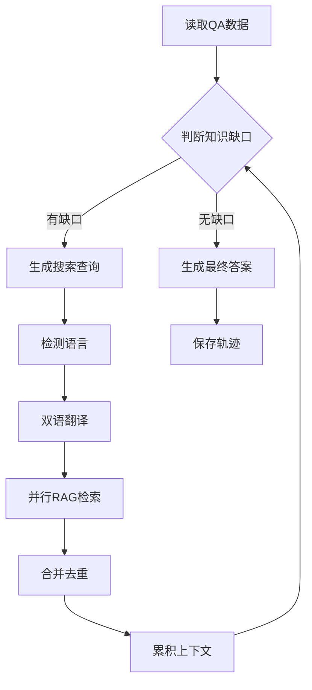

# 轨迹数据处理脚本运行说明

## 📁 项目文件结构

```
/workspace/
├── 轨迹数据整理.py          # 将原始轨迹转换为训练格式
├── 轨迹蒸馏.py               # 自动生成推理轨迹
├── trajectory.jsonl          # 输入: 原始轨迹数据
├── qa_data.jsonl            # 输入: QA对数据
├── train_agent_data.jsonl   # 输出: 训练集
├── eval_agent_data.jsonl    # 输出: 评估集
└── inference_trajectory.jsonl # 输出: 推理轨迹
```

---

## 🔧 脚本1: 轨迹数据整理.py

### ✅ 运行状态: **已成功运行**

### 📋 功能说明
将原始的多跳RAG推理轨迹转换为LlamaFactory ShareGPT格式,用于训练AI Agent。

### 🎯 输入要求
- **文件**: `trajectory.jsonl`
- **格式**: 每行一个JSON对象,包含:
  - `question_id`: 问题ID
  - `question`: 用户问题
  - `win_answer`: 标准答案
  - `full_trace`: 推理轨迹数组
    - 每个hop包含: `hop`, `knowledge_gap`, `reasoning`, `query`, `retrieved_chunks`

### 📤 输出结果
- `train_agent_data.jsonl` (95%训练集)
- `eval_agent_data.jsonl` (5%评估集)

### 🏃 运行命令
```bash
python3 轨迹数据整理.py
```

### ✅ 运行结果
```
正在从 'trajectory.jsonl' 读取数据...
成功转换 2 条数据。
切分数据集: 1 (训练) / 1 (评估)
```

### 📊 数据格式示例
生成的训练数据采用多轮对话格式:
1. **system** → 系统提示(包含工具定义和推理流程)
2. **user** → 用户问题
3. **assistant** → `<think>推理</think>` + `<tool_call>工具调用</tool_call>`
4. **tool** → 工具返回的知识块
5. (重复3-4,多跳推理)
6. **assistant** → `<think>最终思考</think>` + `<answer>答案</answer>`

### 🔑 核心特性
- ✅ 自动处理1-5跳的多轮推理
- ✅ 跨轮次去重知识块
- ✅ 支持最大调用次数限制
- ✅ 自动创建输出目录
- ✅ 正确处理中文字符

---

## 🤖 脚本2: 轨迹蒸馏.py

### ⚠️ 运行状态: **需要外部服务**

### 📋 功能说明
自动化的RAG推理管道,通过迭代调用LLM和RAG工具生成完整的推理轨迹。

### 🔌 外部依赖 (必需)

#### 1️⃣ **vLLM API服务**
```yaml
地址: http://127.0.0.1:8000/v1/chat/completions
模型: Qwen3-32B (需要加载LoRA微调模型)
API密钥: EMPTY
```
**启动方法**:
```bash
vllm serve /mnt/storage/LLM/liangyan/models/trained/lora/merge/qwen3-32b-lora_dpo_aug_reranked_v11_checkpoint-720 \
  --host 127.0.0.1 \
  --port 8000 \
  --api-key EMPTY
```

#### 2️⃣ **RAG检索服务**
```yaml
地址: http://218.104.107.132:5002/mongodb
接口: POST /mongodb
参数: {id: 102, top_doc_num: 5, query: "问题"}
```

#### 3️⃣ **火山引擎API** (可选,用于中英翻译)
```yaml
Access Key: AKLTOWZhOWQ1ZjAzZTFkNDc2NjhmNTJjMmVkYmQ2NmIzODA
Secret Key: (Base64编码)
功能: 语种检测 + 文本翻译
```

#### 4️⃣ **Python依赖**
```bash
pip install requests tqdm volcengine volcenginesdk-translate
```

### 🎯 输入要求
- **文件**: `qa_data.jsonl`
- **格式**: 每行一个JSON对象
  ```json
  {"question_id": "qa_001", "question": "问题内容", "answer": "标准答案"}
  ```

### 📤 输出结果
- `inference_trajectory.jsonl` - 包含完整推理轨迹的JSONL文件

### 🏃 运行命令
```bash
# 守护进程模式(持续运行,自动处理新任务)
python3 轨迹蒸馏.py

# 按 Ctrl+C 停止
```

### 🔄 工作流程



### 🔑 核心特性
- 🔄 **守护进程模式**: 持续监控输入文件,自动处理新任务
- 🔁 **失败重试**: 自动保存部分轨迹,下次运行时重试失败任务
- 🌐 **双语混合搜索**: 中英文自动翻译 + 并行检索 + 去重
- ⚡ **并发处理**: 支持多线程并发(默认4 workers)
- 🛡️ **防循环**: 最多5跳,防止无限循环
- 📊 **进度跟踪**: tqdm进度条显示

### ⚙️ 配置参数
编辑脚本中的 `CONFIG` 字典:
```python
CONFIG = {
    "VLLM_API_ENDPOINT": "http://127.0.0.1:8000/v1/chat/completions",
    "VLLM_MODEL_NAME": "模型路径",
    "INPUT_FILE": "qa_data.jsonl",
    "OUTPUT_FILE": "inference_trajectory.jsonl",
    "MAX_WORKERS": 4,     # 并发数
    "MAX_HOPS": 5,        # 最大RAG调用次数
    "POLL_INTERVAL_SECONDS": 60  # 检查间隔(秒)
}
```

### ⚠️ 运行前检查
```bash
# 1. 检查vLLM服务
curl http://127.0.0.1:8000/v1/models

# 2. 检查RAG服务
curl -X POST http://218.104.107.132:5002/mongodb \
  -H "Content-Type: application/x-www-form-urlencoded" \
  -d "id=102&top_doc_num=5&query=测试问题"

# 3. 检查Python依赖
python3 -c "import requests, tqdm; print('✅ 依赖已安装')"
```

### 🚫 当前无法运行的原因
- ❌ vLLM服务未运行在端口8000
- ❌ RAG检索服务地址可能无法访问
- ❌ 火山引擎API凭证需要验证

---

## 📊 数据流程图

```
原始数据采集
    ↓
[trajectory.jsonl] ─────→ 轨迹数据整理.py ─────→ train_agent_data.jsonl
                                              └──→ eval_agent_data.jsonl
                                                        ↓
                                                   训练AI Agent
                                                        ↓
                                                   微调后的模型
                                                        ↓
[qa_data.jsonl] ────────→ 轨迹蒸馏.py ─────────→ inference_trajectory.jsonl
  (使用微调模型生成)                            (可作为新的训练数据)
                                                        ↓
                                                   循环迭代训练
```

---

## 🎓 典型使用场景

### 场景1: 训练数据准备
1. 手工标注 `trajectory.jsonl` (包含标准推理轨迹)
2. 运行 `轨迹数据整理.py`
3. 使用生成的 `train_agent_data.jsonl` 训练模型

### 场景2: 数据蒸馏(模型自举)
1. 使用已训练的模型启动vLLM服务
2. 准备大量QA对 `qa_data.jsonl`
3. 运行 `轨迹蒸馏.py` 自动生成推理轨迹
4. 生成的 `inference_trajectory.jsonl` 可用于:
   - 作为新的训练数据(再次运行轨迹数据整理.py)
   - 评估模型的推理能力
   - 持续改进模型(迭代训练)

---

## 🐛 常见问题

### Q1: 轨迹数据整理.py 报错 "找不到源文件"
**A**: 确保 `trajectory.jsonl` 文件存在于当前目录

### Q2: 轨迹蒸馏.py 报错 "connection refused"
**A**: 检查vLLM服务是否运行:
```bash
ps aux | grep vllm
netstat -tlnp | grep 8000
```

### Q3: RAG检索返回空结果
**A**: 检查RAG服务状态和网络连接,确保查询格式正确

### Q4: 火山引擎API报错
**A**: 验证AK/SK是否有效,或设置为None禁用翻译功能(仅使用原文检索)

---

## 📝 日志说明

### 轨迹数据整理.py 日志
```
正在从 'trajectory.jsonl' 读取数据...
成功转换 2 条数据。
切分数据集: 1 (训练) / 1 (评估)
```

### 轨迹蒸馏.py 日志
```
--- 管道开始运行 (守护+重试模式) ---
已加载 0 个 *成功* 处理的 ID.
发现新任务: 2
🚀 [RAG Tool] 开始处理查询: '问题内容？'
🔍 [RAG Tool] 检测到语种: zh
🌐 [RAG Tool] 中文 -> 英文: 'Question content?'
✅ [RAG Tool] 处理完成, 返回 5 个去重后的 chunks.
✅ QID qa_001: 任务成功完成.
--- 本轮处理完毕 ---
  成功: 2
  失败 (将重试): 0
```

---

## 📚 参考资源

- **LlamaFactory**: https://github.com/hiyouga/LLaMA-Factory
- **vLLM**: https://docs.vllm.ai/
- **ShareGPT格式**: 多轮对话训练格式标准

---

## ✅ 总结

| 脚本 | 状态 | 输入 | 输出 | 主要用途 |
|-----|------|------|------|---------|
| 轨迹数据整理.py | ✅ 已运行 | trajectory.jsonl | train/eval_agent_data.jsonl | 训练数据格式转换 |
| 轨迹蒸馏.py | ⚠️ 需要外部服务 | qa_data.jsonl | inference_trajectory.jsonl | 自动生成推理轨迹 |

**当前工作目录状态**:
- ✅ 示例数据已创建
- ✅ 第一个脚本已成功运行
- ✅ 训练/评估数据已生成
- ⚠️ 第二个脚本需要外部服务才能运行
